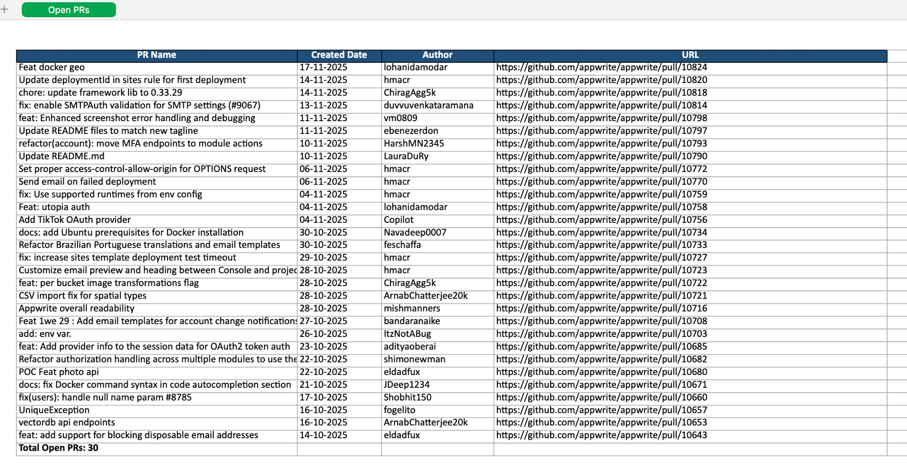

E2E Test Suite

This End-to-End (E2E) test suite validates both the core login functionality and the overall health of the e-commerce application using Playwright.
It includes strict checks for:

Console errors

Broken links

Multiple login scenarios (success, failure, and edge cases)

GitHub Open PR Reporting — validates the GitHub /pulls API, generates a CSV/Excel-compatible report, and ensures correct formatting, escaping, and placeholder handling for missing fields

Note:
The generated CSV/Excel file is saved inside the framework directory.
VS Code cannot open it by simply clicking on the file name—you must open it manually in Excel or another CSV viewer.

🛠 Installation

Clone this repository:

git clone https://github.com/nadiaghulamali/FashionHub_E2E.git

Install dependencies:

npm install

Playwright browsers (if needed):

npx playwright install

▶️ Running the Test Suite
Run all tests:
npx playwright test

Run a specific test:
npx playwright test tests/login.spec.ts

🐳 Docker Support

This project includes a Docker setup for stable, reproducible test execution—ideal for CI/CD pipelines.

Build the Docker image:
docker build -t fashionhub-tests .

Run tests:
docker run --rm fashionhub-tests

Run tests for a specific environment:
docker run --rm -e ENV=local fashionhub-tests

To open last HTML report run:

  npx playwright show-report

The --rm flag cleans up the container after execution.

⚙️ CI/CD: GitHub Actions

For reliability, CI uses Docker-based execution.
Typical CI steps include:

Checkout the code

Build Docker image

Execute tests inside the container

Upload artifacts (test-results/)

Example commands:

docker build -t fashionhub-tests .
docker run --rm -e ENV=staging fashionhub-tests

Artifacts such as screenshots, videos, logs, and PR reports are uploaded via GitHub Actions.

